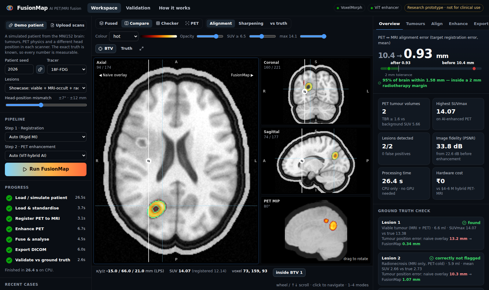
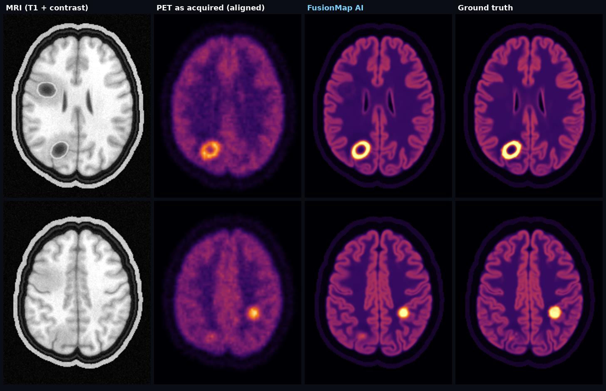
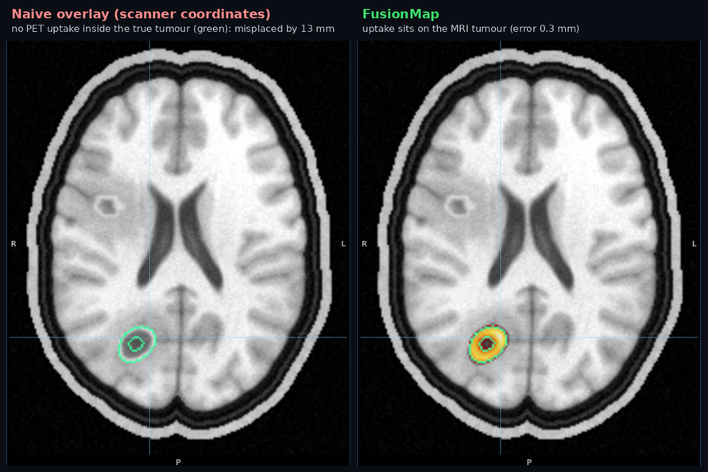
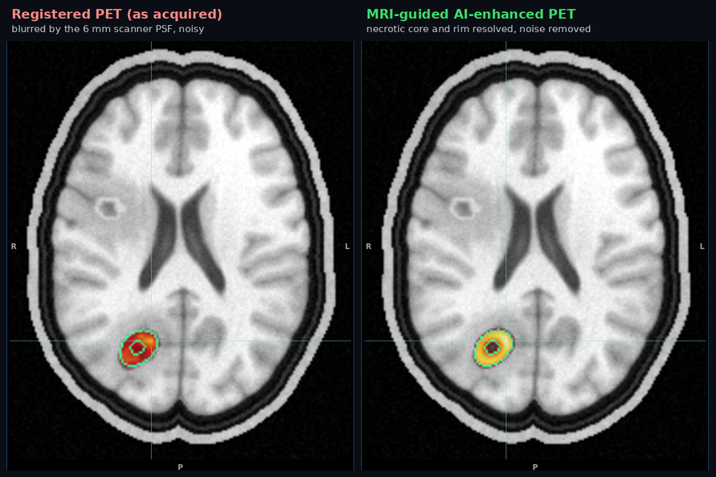
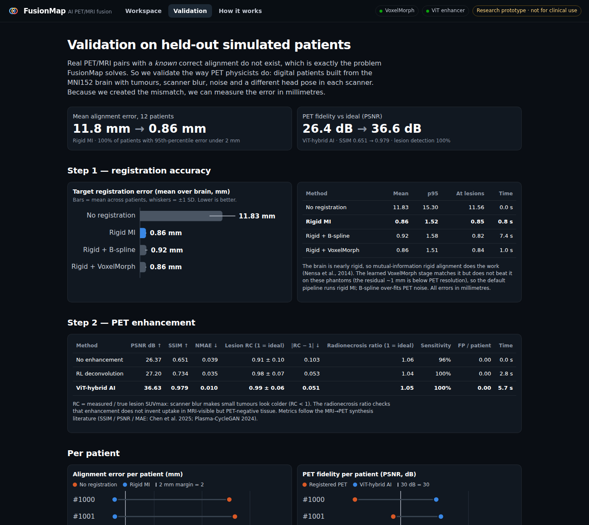
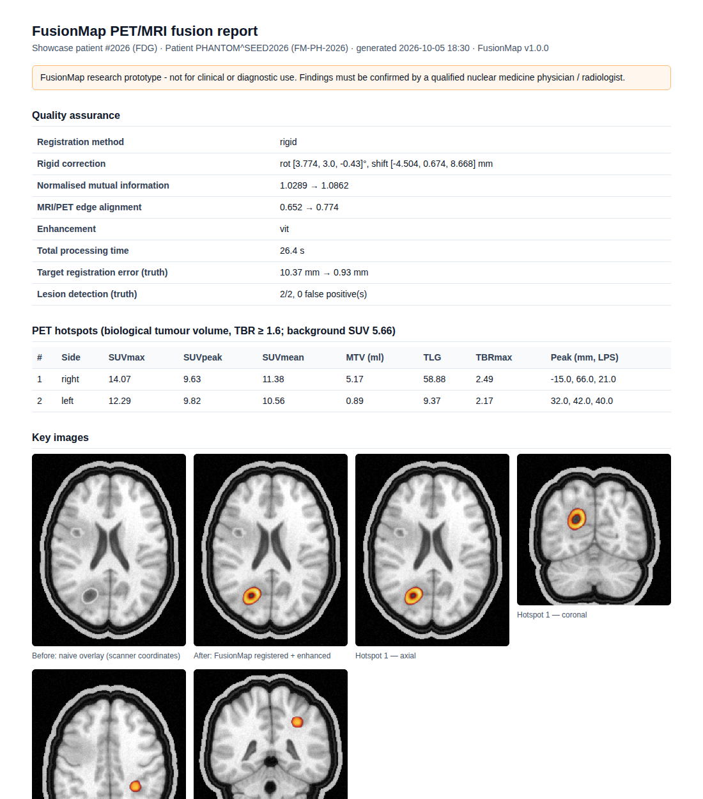
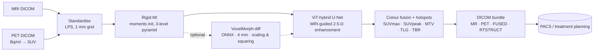

<div align="center">


# FusionMap

### PET-MRI precision without the $4–6 million PET-MRI machine

**An AI software pipeline that fuses separately acquired PET and MRI scans into one clinically usable,
colour-coded DICOM image. It runs on the hospital's existing PC, with no GPU and no new hardware.**

*Team Code Blooded · AI in Healthcare / Medical Imaging & Machine Learning*



</div>

> ⚠️ **Research prototype. It is not a medical device and must not be used for diagnosis or treatment decisions.**

---

## The problem

Integrated PET-MRI scanners cost **$4–6 million**, so precision cancer imaging stays with a handful
of elite hospitals. Yet **700+ cancer centres** outside the metros already own *both* a PET scanner and
an MRI machine. What they lack is a way to combine the two scans. Comparing them side by side by hand
leaves the tumour misplaced by **up to ~15 mm**. That is enough for radiotherapy to miss part of the
tumour and damage healthy tissue.

> PET shows *where the tumour is alive* (metabolism) but is blurry. MRI shows anatomy in sharp
> soft-tissue detail without radiation. CT offers poorer soft-tissue contrast and adds dose.

## The solution: three steps, about one minute, on a CPU

| | Step | How | Result on held-out patients |
|---|---|---|---|
| **1** | **Fix the positional mismatch** | Mutual-information rigid registration; **VoxelMorph-diff** deformable network integrated (fold-free), enabled automatically only when it beats rigid | **11.8 → 0.86 mm** mean alignment error, in 0.8 s |
| **2** | **Sharpen the blurry PET** | **MRI-guided hybrid CNN / Vision-Transformer U-Net** (2.5-D) | **26.4 → 36.6 dB PSNR**, SSIM 0.65 → 0.98, tumour SUV recovery 0.91 → 0.99 |
| **3** | **One colour-coded DICOM** | PET colour-mapped on MRI, plus SUV tumour volumes and an **RT-STRUCT** | 100 % of tumours detected, 0 false positives; drops into any **PACS** via C-STORE |

See the [validation results](#validation-measured-not-claimed) for the exact numbers.

<div align="center">

<br/><sub><b>Step 2 on a held-out patient.</b> Top: a viable necrotic tumour. FusionMap recovers its ring and the
cortical ribbon, while the <i>radionecrosis</i> (the other dark ellipse on the MRI) correctly stays PET-cold.
Bottom: a tumour that is <i>invisible on MRI</i>. FusionMap keeps it, because uptake comes from the PET, not the MRI.</sub>
</div>

<table>
<tr>
<td width="50%"><br/><sub><b>Step 1.</b> Swipe from the naive overlay (left) to FusionMap (right). The PET tumour lands on the MRI lesion.</sub></td>
<td width="50%"><br/><sub><b>Step 2.</b> Registered PET (left) vs MRI-guided AI-enhanced PET (right).</sub></td>
</tr>
<tr>
<td><br/><sub>Every number is measured against exact ground truth on held-out simulated patients.</sub></td>
<td><br/><sub><b>Step 3.</b> Printable case report and a standards-conformant DICOM bundle.</sub></td>
</tr>
</table>

## What makes it different

- **Honest AI.** The showcase patient contains a viable tumour, an **MRI-occult tumour** (PET-only)
  and a **radionecrosis** (MRI-enhancing but PET-cold); training and benchmark patients mix all three
  kinds. FusionMap must find the first two and must not invent uptake in the third. That proves the AI
  takes *uptake* from PET and only *edges* from MRI.
- **Measured, not claimed.** We built digital patients from the MNI152 brain with tumours, scanner
  blur, noise and a different head pose in each scanner. Because we created the mismatch, we report
  alignment error in **millimetres** and tumour SUV recovery per lesion.
- **Real hospital plumbing.**
  - Reads DICOM zips or NIfTI and converts PET Bq/ml to **SUVbw** from the radiopharmaceutical tags.
  - Writes **MR + registered PET + AI PET + RGB fusion + RT-STRUCT** sharing one Frame of Reference.
  - Pushes to a PACS with **C-STORE**; `docker compose up` includes an Orthanc PACS to prove it.
- **Runs anywhere.**
  - Inference is ONNX Runtime on CPU. A full study takes about a minute, and no patient data leaves
    the hospital.
  - PyTorch is needed only for training, and both models train on a laptop CPU in under an hour.
- **Grounded in the literature.** Each design choice traces to one of the papers we reviewed; see
  [docs/LITERATURE.md](docs/LITERATURE.md).

## Quick start

```bash
# 1) install (Python 3.10+)
python -m venv .venv && source .venv/bin/activate
pip install -e .

# 2) run the web app + API  ->  http://localhost:8000
fusionmap serve
```

The web app ships pre-built inside the package (`fusionmap/static`). On first start, the server
simulates and processes a showcase patient, so the workspace is populated within a minute.

| Want to… | Do this |
|---|---|
| Use the full hospital demo with a real PACS | `docker compose up --build` → FusionMap on `:8000`, Orthanc PACS on `:8042` (Export tab → *Send*) |
| Run the pipeline from the terminal | `fusionmap demo --seed 2026` |
| Process your own scans | `fusionmap run --mri mri_dicom.zip --pet pet_dicom.zip --out results/` |
| Make hospital-style test DICOM | `fusionmap phantom --seed 3 --dicom --out var/phantom` (two separate studies, PET in Bq/ml) |
| Reproduce the validation table | `fusionmap benchmark --cases 12` |
| Retrain the AI models | `pip install -e ".[train]" && make data train` ([docs/TRAINING.md](docs/TRAINING.md)) |
| Work on the web app | `cd web && npm install && npm run dev` (proxies `/api` to `:8000`) |
| Run the tests | `pip install -e ".[dev]" && pytest` |

## Validation: measured, not claimed

<!-- RESULTS:START -->
*12 held-out simulated patients (seeds 1000–1011, never seen in training), FDG and FET alternating, 2–3 lesions each incl. MRI-occult tumours and radionecrosis. CPU only. Generated by `fusionmap benchmark` on 2026-10-05.*

**Step 1 — alignment error (target registration error over the whole brain)**

| Method | Mean TRE (mm) | p95 TRE (mm) | At tumour centres (mm) | Patients with p95 < 2 mm | Time (s) |
|---|---:|---:|---:|---:|---:|
| No registration (scanner coordinates) | 11.83 ± 1.86 | 15.30 | 11.56 | 0 % | 0.0 |
| Rigid mutual information | 0.86 ± 0.07 | 1.52 | 0.85 | 100 % | 0.8 |
| Rigid MI + B-spline (classical) | 0.92 ± 0.16 | 1.58 | 0.82 | 100 % | 7.4 |
| Rigid MI + **VoxelMorph** (AI) | 0.86 ± 0.07 | 1.51 | 0.84 | 100 % | 1.0 |

**Step 2 — PET quality against the ideal (blur-free, noise-free) PET**

| Method | PSNR (dB) ↑ | SSIM ↑ | NMAE ↓ | Lesion SUVmax recovery (1 = exact) | Radionecrosis uptake ratio (1 = no hallucination) | Tumours detected | False positives / patient | Time (s) |
|---|---:|---:|---:|---:|---:|---:|---:|---:|
| Registered PET, not enhanced | 26.37 | 0.651 | 0.0392 | 0.91 ± 0.10 | 1.06 | 96 % | 0.00 | 0.0 |
| Richardson–Lucy + MRI-guided filter (classical) | 27.20 | 0.734 | 0.0354 | 0.98 ± 0.07 | 1.04 | 100 % | 0.00 | 2.8 |
| **ViT-hybrid U-Net** (AI, MRI-guided) | 36.63 | 0.979 | 0.0101 | 0.99 ± 0.06 | 1.05 | 100 % | 0.00 | 5.7 |
<!-- RESULTS:END -->

*How to read this.*

- **TRE** is the distance between where the registration maps each brain point and where it truly
  belongs.
- **Lesion recovery** is measured SUVmax ÷ true SUVmax. Scanner blur makes small tumours look colder
  than they are (recovery < 1), which is the partial-volume effect.
- **Radionecrosis ratio** is mean uptake ÷ true uptake inside a PET-negative lesion. Values above 1
  mean the method painted MRI structure into the PET.
- The PSNR / SSIM / MAE metrics are the ones used in the MRI→PET synthesis literature.

**Takeaways.**

1. Naive overlay errs by **11.8 mm on average and 15.3 mm at the 95th percentile**. That is the
   "up to 15 mm" problem, reproduced and measured.
2. Mutual-information registration removes it: **0.86 mm** in under a second, with every patient's
   95th-percentile error inside 2 mm.
3. The learned VoxelMorph *matches* rigid MI on the nearly rigid brain but does not beat it, so `auto`
   keeps rigid MI.
4. The MRI-guided ViT enhancer improves PSNR by **+10.3 dB** and cuts error 4×. It brings tumour
   SUVmax to within 1 % of truth on average, and adds **no** false uptake to radionecrosis (1.05 vs
   1.06 unenhanced).

Limitations are listed honestly in [docs/VALIDATION.md](docs/VALIDATION.md).

## How it works



- **Registration.**
  - Mattes mutual information handles the opposite contrast of the two scanners: grey matter is dark
    on T1 but bright on FDG.
  - The brain is nearly rigid, so rigid MI does most of the work (Nensa et al. 2014).
  - VoxelMorph-diff predicts a stationary velocity field that is integrated into a diffeomorphic
    warp in one forward pass; its minimum Jacobian determinant is reported to prove there is no
    folding.
  - **An honest result:** on brain phantoms, VoxelMorph matched but did not beat rigid MI (residual
    1.172 vs 1.173 mm). The leftover ~1 mm distortion is below what 6 mm-resolution PET resolves.
    FusionMap's `auto` mode only enables a learned model whose own validation beats the classical
    baseline, so the default stays rigid MI. VoxelMorph remains one click away and is the engine for
    deformable body sites on the roadmap.
- **Enhancement.**
  - A U-Net with a 4-layer Vision-Transformer bottleneck reads three neighbouring slices of PET and
    MRI and predicts the sharp PET. Convolutions keep local detail; attention captures global context.
  - Training uses a lesion-weighted L1 loss plus an edge loss. A conditional **CycleGAN** trainer
    covers hospitals that only have *unpaired* data.
- **Fusion & analysis.**
  - PET is colour-mapped above a tumour-to-background threshold. Biological tumour volumes use
    **TBR ≥ 1.6**, the RANO/EANO/EANM amino-acid PET criterion.
  - Each tumour reports SUVmax, SUVpeak (1 ml sphere), SUVmean, MTV and TLG.
- **Export.**
  - PET is stored as quantitative SUVbw (`Units = GML`, per-slice rescale).
  - The fused image is RGB Secondary Capture.
  - Contours are closed planar RT-STRUCT ROIs referencing the MR slices, so planning systems can
    import them.

Details: [docs/ARCHITECTURE.md](docs/ARCHITECTURE.md) · Training: [docs/TRAINING.md](docs/TRAINING.md) ·
Pitch & demo script: [docs/PITCH.md](docs/PITCH.md)

## Repository layout

```
fusionmap/            Python package (inference, API, CLI) — no PyTorch needed
  phantom.py          digital PET/MRI patients with exact ground truth
  registration/       rigid & B-spline MI (SimpleITK), VoxelMorph (ONNX), GT-free QA
  enhancement/        ViT-hybrid enhancer (ONNX), Richardson–Lucy baseline
  fusion.py analysis.py metrics.py pipeline.py benchmark.py
  export/             DICOM writers (MR, PET, SC-RGB, RTSTRUCT), PACS C-STORE, HTML report
  api/                FastAPI + SSE progress + case store
  models/             trained ONNX models + model cards
  static/             built web app
training/             PyTorch: networks, data generation, trainers (enhancer, VoxelMorph, CycleGAN)
web/                  React + TypeScript viewer (Vite)
tests/                pytest: phantoms, registration, enhancement, DICOM round-trip, PACS, API
docs/                 architecture, validation, literature, training, pitch, benchmark.json
```

## Cost & impact

| | Cost |
|---|---|
| Integrated PET-MRI scanner | **$4–6 million** per site |
| FusionMap build (team estimate) | **₹40,000–60,000**, mostly GPU time; frameworks, TCIA data and tools are free |
| Extra hardware for a hospital that owns PET + MRI | **₹0**: runs on CPU |

Extending precision imaging from ~10 elite hospitals to **700+ oncology centres** could improve
treatment accuracy for the **6–8 lakh** cancer patients treated in India each year *(team estimates)*.

## Roadmap

1. Fine-tune on real paired PET/MRI (brain, lung and prostate collections in **TCIA**). The trainers
   already accept real NIfTI/DICOM pairs.
2. Extend to body sites. Deformation dominates there (breathing, bladder filling), and PSMA-PET is
   the target for prostate.
3. Ship a PACS plug-in (OHIF extension), run reader studies with nuclear-medicine physicians, and
   pursue the CDSCO software-as-a-medical-device route.

## Team Code Blooded

Atharva Jadhav · Anushka Ghodekar · Rohan Leo

## Licence & data

- Code: MIT (see `LICENSE`).
- The digital phantoms derive from the **MNI ICBM152 2009a** template © McConnell Brain Imaging
  Centre, used under its permissive licence (`fusionmap/data/templates/LICENSE.md`).
- Built on SimpleITK, pydicom, pynetdicom, ONNX Runtime, PyTorch, FastAPI and React.
