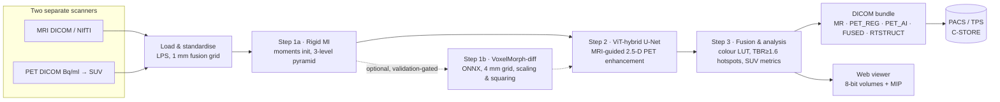

# Architecture

## Packages

| Path | Responsibility |
|---|---|
| `fusionmap/imaging.py` | SimpleITK helpers: canonical LPS orientation, resampling, masks, crops |
| `fusionmap/io.py` | DICOM series / zip / NIfTI loading, SUVbw conversion from radiopharmaceutical tags |
| `fusionmap/phantom.py` | Digital PET/MRI patients with exact ground truth (anatomy, tumours, PET physics, misalignment) |
| `fusionmap/registration/` | `classical.py` (rigid MI, B-spline MI), `learned.py` (VoxelMorph ONNX), `quality.py` (NMI, edge alignment) |
| `fusionmap/enhancement/` | `ai.py` (ViT-hybrid ONNX), `classical.py` (Richardson–Lucy + MRI-guided filter) |
| `fusionmap/fusion.py` | Colour tables (shared with the web viewer) and PET-on-MRI blending |
| `fusionmap/analysis.py` | Hotspots: SUVmax / SUVpeak / SUVmean / MTV / TLG / TBR, laterality |
| `fusionmap/metrics.py` | TRE, PSNR, SSIM, NMAE, lesion recovery, hallucination, detection |
| `fusionmap/export/` | `dicom.py` (MR, PET, SC-RGB, RTSTRUCT writers), `pacs.py` (C-ECHO / C-STORE), `report.py` (HTML) |
| `fusionmap/pipeline.py` | Orchestration with progress events and the case report |
| `fusionmap/api/` | FastAPI app, case store, single-worker job queue, SSE progress |
| `fusionmap/benchmark.py` | Held-out phantom validation |
| `training/` | PyTorch networks, data generation, trainers (enhancer, VoxelMorph, CycleGAN), ONNX export |
| `web/` | React + TypeScript viewer (Vite), built into `fusionmap/static` |

## Conventions

- **Physical space.** DICOM patient coordinates (LPS: +x patient left, +y posterior,
  +z superior). Every volume on the fusion grid has identity direction cosines, so
  `array[k, j, i]` sits at `origin + (i, j, k)·spacing`.
- **Transforms.** ITK convention: a registration transform maps *fixed* (MRI) points to
  *moving* (PET) points. The final transform is `Composite([rigid, displacement])`, meaning
  `rigid(p + u(p))`.
- **Model gating.** `registration="auto"` uses VoxelMorph only if `learned.is_beneficial()`, i.e.
  the model card's held-out validation beats rigid-only. `enhancement="auto"` uses the ViT hybrid
  whenever its ONNX model is present, else Richardson–Lucy.
- **Display.** Radiological convention: patient right on screen left, anterior up in axial,
  superior up in coronal and sagittal.

## AI model contracts (shared by training and inference)

| | VoxelMorph-diff | ViT-hybrid enhancer |
|---|---|---|
| Input | `[1, 2, 48, 56, 48]`: MRI and rigidly-aligned PET, sampled at 2 mm then mean-pooled to 4 mm, each ÷ in-head p99 | `[N, 6, H, W]`: PET z−1, z, z+1 and MRI z−1, z, z+1 on the 1 mm grid; PET ÷ p99.5, MRI ÷ p99; H, W multiples of 16 |
| Output | velocity `[1, 3, 24, 28, 24]` (8 mm voxels, `dz, dy, dx`) | sharp PET of the centre slice (same normalisation) |
| Post-processing | 7-step scaling & squaring, then upsample to the 4 mm grid → displacement-field transform | × PET scale, clip ≥ 0, zero outside the head |
| Runtime | ONNX Runtime, CPU, < 1 s | ONNX Runtime, CPU, ~10 s for a whole head |

The preprocessing functions live in `fusionmap/` and are imported by `training/`, so there is
no train/inference skew. PyTorch is a training-only dependency; the shipped app needs only
ONNX Runtime.

## DICOM output

Every series in the bundle shares the MRI's patient identity, one `StudyInstanceUID` and one
`FrameOfReferenceUID`. That lets PACS viewers link them spatially, and lets treatment-planning
systems place the RT-STRUCT contours on the MR.

| Folder | IOD | Notes |
|---|---|---|
| `MR/` | MR Image Storage | Reference anatomy on the fusion grid (`DERIVED\SECONDARY`) |
| `PET_REG/` | PET Image Storage | Registered PET, `Units = GML` (SUVbw), per-slice `RescaleSlope` |
| `PET_AI/` | PET Image Storage | AI-enhanced PET, same encoding |
| `FUSED/` | Secondary Capture | RGB colour fusion as shown on screen |
| `RTSTRUCT/` | RT Structure Set | One ROI per hotspot (`CLOSED_PLANAR`), referencing the MR slices |

## Web API

| Method | Path | Purpose |
|---|---|---|
| GET | `/api/health` | Version, model availability and model cards, PACS defaults |
| GET | `/api/colormaps` | Colour tables (256 × RGB) |
| POST | `/api/cases/demo` | Simulate a patient and run the pipeline |
| POST | `/api/cases/upload` | Multipart upload of `mri` and `pet` (DICOM `.zip` or NIfTI) |
| GET | `/api/cases/{id}` | Case state and the full report |
| GET | `/api/cases/{id}/events` | Server-Sent Events: step and progress stream |
| GET | `/api/cases/{id}/viewer/{file}` | Pre-gzipped 8-bit volumes, manifest, MIP sprite |
| GET | `/api/cases/{id}/exports/{dicom.zip, report.html, pet.nii.gz, mri.nii.gz, report.json}` | Downloads |
| POST | `/api/cases/{id}/pacs` | C-STORE the bundle to a PACS |
| POST | `/api/pacs/echo` | C-ECHO test |
| GET | `/api/benchmark` | Latest validation results |

Interactive API docs are served at `/docs`.
